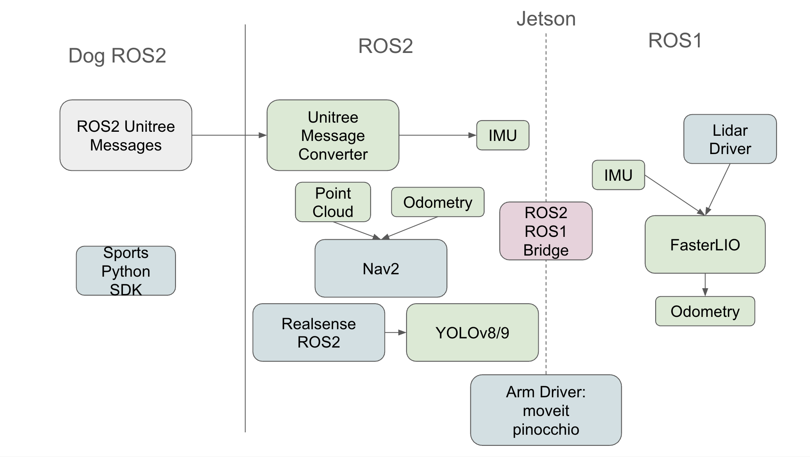
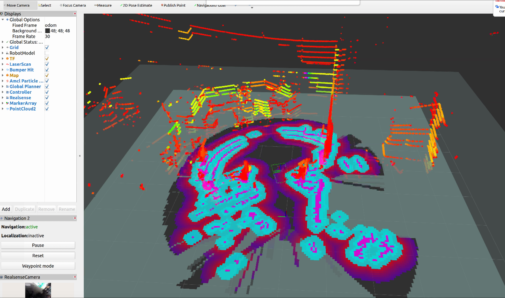

# Unitree Go Robot ROS Packages Installation Guide

This repository contains comprehensive ROS packages for the Unitree Go robot system, supporting both ROS1 and ROS2 environments, directly running on the Jetson board. The system includes SLAM, navigation, object detection, robotic arm control, and camera integration capabilities.

<p align="center">
  
  
</p>
<p align="center">
  <em>Autonomous Navigation with Nav2</em>
  &nbsp;&nbsp;&nbsp;&nbsp;&nbsp;&nbsp;&nbsp;&nbsp;&nbsp;&nbsp;&nbsp;&nbsp;&nbsp;&nbsp;&nbsp;&nbsp;&nbsp;&nbsp;&nbsp;&nbsp;
  <em>Maestro Demo on Mobile Manipulation</em>
</p>

## Table of Contents
- [Overview](#overview)
- [System Requirements](#system-requirements)
- [Quick Start](#quick-start)
- [ROS1 Installation](#ros1-installation)
- [ROS2 Installation](#ros2-installation)
- [RViz Visualization](#rviz-visualization)
- [Package Overview](#package-overview)
- [Usage Examples](#usage-examples)
- [Configuration](#configuration)
- [Troubleshooting](#troubleshooting)

## Overview

This repository provides a complete robotics software stack for the Unitree Go robot, featuring:

- **SLAM**: Faster-LIO for high-performance LiDAR-inertial odometry
- **Navigation**: Nav2 with velocity commands
- **Object Detection**: YOLOv8/YOLOv9 with 3D capabilities
- **Robotic Arm Control**: Piper arm with CAN-based communication
- **Camera Integration**: Intel RealSense RGB-D cameras
- **Multi-Sensor Fusion**: LiDAR, IMU, camera, and depth sensors



## System Requirements

### Hardware Requirements
- **Robot Platform**: Unitree Go2/Go2W robot
- **Computing Platform**: NVIDIA Jetson (Unitree expansion dock)
- **Additional Sensors**: 
  - LiDAR (Hesai, Velodyne, Ouster, or Livox)
  - Intel RealSense camera
  - IMU/Gyroscope from body
- **Interfaces**: CAN interface for robotic arm control

### Software Requirements

- ROS Noetic
- ROS2 foxy
- Python 3.8

## Installation

```bash
# Clone the repository
git clone https://github.com/Selina22/unitree_go_jetson.git
cd unitree_go_jetson
```

### Python dependencies
```bash
sudo apt update
sudo apt install -y libxml2-dev libxslt1-dev zlib1g-dev python3-dev build-essential
pip3 install -r requirements.txt
```

Install unitree sdk python from https://github.com/unitreerobotics/unitree_sdk2_python

### ROS1 Installation (Hesai lidar, fasterlio)

```bash
cd unitree_ros1

# Build workspace
catkin_make

# Source workspace
source devel/setup.bash
```

#### Hesai lidar

Setup the device ip address in [config.yaml](/unitree_ros1/src/HesaiLidar_ROS_2.0/config/config.yaml) following the set up guide in [HesaiLidar_ROS_2.0](/unitree_ros1/src/HesaiLidar_ROS_2.0/README.md).

### ROS2 Installation (nav2, piper, realsense, unitree message converter, yolo)

```bash
# First build the unitree ros2 cyclone dds workspace
cd unitree_ros2/cyclonedds_ws/
export LD_LIBRARY_PATH=/opt/ros/foxy/lib
colcon build --packages-select cyclonedds #Compile cyclone-dds package
# Then build the unitree messages under the same directory
source /opt/ros/foxy/setup.bash
colcon build
```

#### Environment Configuration

Connect with the robot via the network interface in [setup.sh](/unitree_ros2/setup.sh)

```bash
#!/bin/bash
echo "Setup unitree ros2 environment"
source /opt/ros/foxy/setup.bash
source $HOME/unitree_ros2/cyclonedds_ws/install/setup.bash
export RMW_IMPLEMENTATION=rmw_cyclonedds_cpp
export CYCLONEDDS_URI='<CycloneDDS><Domain><General><Interfaces>
                            <NetworkInterface name="enp3s0" priority="default" multicast="default" />
                        </Interfaces></General></Domain></CycloneDDS>'
```
where "enp3s0" is the network interface name of unitree robot connected. Check your interface name from the output of ```ifconfig```


#### Build ROS2 Workspace

```bash
cd unitree_ros2

# Source ROS2
source /opt/ros/$ROS_DISTRO/setup.bash

# Build CycloneDDS workspace
colcon build --packages-select nav2_cloud_bringup piper piper_msgs realsense2_camera_msgs yolov8_msgs yolov8_ros

source setup.sh
```

## RViz Visualization

After launching the robot system with the unified launch script, you can visualize all sensor data, navigation, and planning in RViz2.


*RViz2 showing real-time navigation with LiDAR point clouds, costmaps, planned paths, and RealSense camera feed*

### Launch RViz2

```bash
# Make sure ROS2 environment is sourced
cd unitree_ros2
source setup.sh

# Launch RViz2 with the default navigation configuration
rviz2 -d ./src/nav2_cloud_bringup/nav2_default_view.rviz
```

### Sending Navigation Goals

#### Method 1: Using RViz2 (GUI)
1. Click the **"2D Nav Goal"** button in the RViz toolbar
2. Click on the map where you want the robot to go
3. Drag to set the desired orientation
4. Release to send the goal

#### Method 2: Using Command Line
```bash
# Send a navigation goal via command line
ros2 topic pub --once /goal_pose geometry_msgs/PoseStamped "{
  header: {
    frame_id: 'odom'
  },
  pose: {
    position: {x: 2.0, y: 1.0, z: 0.0},
    orientation: {x: 0.0, y: 0.0, z: 0.0, w: 1.0}
  }
}"
```

## Package Overview

### ROS1 Packages

#### 1. faster-lio
- **Purpose**: High-performance LiDAR-inertial odometry
- **Features**: 
  - 1k-2k Hz processing for solid-state LiDARs
  - Support for multiple LiDAR types
  - Real-time mapping and localization
- **Dependencies**: PCL, Eigen, glog, yaml-cpp

#### 2. HesaiLidar_ROS_2.0
- **Purpose**: ROS driver for Hesai LiDAR sensors
- **Features**: Real-time point cloud publishing, configurable parameters
- **Dependencies**: ROS sensor_msgs, std_msgs

#### 3. piper_ros
- **Purpose**: Piper robotic arm control
- **Features**: CAN communication, MoveIt integration, gripper control
- **Dependencies**: python-can, piper_sdk, MoveIt

### ROS2 Packages

#### 1. nav2_cloud_bringup
- **Purpose**: Nav2 navigation with point cloud integration
- **Features**: Local/global planning, Faster-LIO integration, RViz configs
- **Dependencies**: Nav2 stack, TF2, sensor_msgs

#### 2. yolo_ros
- **Purpose**: YOLOv8/YOLOv9 object detection and tracking
- **Features**: Real-time detection, 3D object detection, pose estimation
- **Dependencies**: OpenCV, Ultralytics, CUDA

#### 3. realsense-ros
- **Purpose**: Intel RealSense camera integration
- **Features**: RGB-D support, IMU integration, calibration
- **Dependencies**: librealsense2, OpenCV

#### 4. unitree_msg_converter
- **Purpose**: Message conversion utilities
- **Features**: ROS1 to ROS2 conversion, custom message types
- **Dependencies**: ROS2 message types

## Usage Examples

### Unified Launch System (Recommended)

The **unified launch script** (`launch_ros.py`) provides a single-command solution to start all ROS1 and ROS2 components with proper sequencing and ROS bridge integration.

#### Quick Start

```bash
# Launch with default configuration
python3 launch_ros.py

# Launch with custom configuration file
python3 launch_ros.py robot_config.yaml

# Cleanup all ROS processes
python3 launch_ros.py --cleanup
```

#### Configuration

Create or edit `robot_config.yaml` to customize which components to launch:

```yaml
# Core Infrastructure (always required)
core_infrastructure:
  ros1_core: true
  ros_bridge: true

# Camera Configuration
realsense:
  enabled: true

# YOLO Object Detection
yolo:
  enabled: false
  workspace: /home/unitree/yolo_ws
  launch_file: yolov9.launch.py
  model_weights: /path/to/yolov9c.pt
  input_image_topic: /camera/color/image_raw
  device: cuda:0
  image_reliability: 2
  threshold: 0.5

# Robotic Arm Module
arm_module:
  enabled: false

# Hardware Drivers
lidar_driver:
  enabled: true
  driver: hesai_ros_driver_node

# SLAM Configuration
slam:
  enabled: true
  algorithm: faster_lio
  launch_file: mapping_hesai.launch
  rviz: false

# Navigation Configuration
navigation:
  enabled: true
  params_file: src/nav2_cloud_bringup/launch/nav2_params_online_fasterlio.yaml

# Message Converters
message_converters:
  imu_converter: true
  tf_publishers: true

# Launch Delays (seconds)
delays:
  ros_bridge: 3
  ros2_systems: 5
  imu_converter: 2
  tf_publishers: 1
  joint_relay: 1
  lidar_driver: 2
  slam: 3
  navigation: 5

# Log Filtering
log_filtering:
  enabled: true
  suppress_verbose_logs: true
  suppress_timestamps: true
```

#### Features

- **🌉 ROS Bridge Integration**: Automatic bidirectional communication between ROS1 and ROS2
- **⚙️ Configurable Components**: Enable/disable components via YAML configuration
- **🔄 Proper Sequencing**: Components start in the correct order with configurable delays
- **📊 Process Management**: Automatic process monitoring and graceful shutdown
- **🧹 Log Filtering**: Optional filtering of verbose logs for cleaner output
- **🛑 Clean Shutdown**: Press Ctrl+C to gracefully stop all processes

#### Launch Sequence

The system starts components in this order:

1. **ROS1 Core** (`roscore`) - Immediate
2. **ROS Bridge** (`ros1_bridge dynamic_bridge --bridge-all-topics`) - +3 seconds
3. **RealSense Camera** (if enabled) - +5 seconds
4. **IMU Converter** - +2 seconds
5. **TF Publishers** - +1 second
6. **Arm Module** (if enabled) - +1 second
7. **LiDAR Driver** - +2 seconds
8. **SLAM (Faster-LIO)** - +3 seconds
9. **Navigation (Nav2)** - +5 seconds

#### System Monitoring

```bash
# Monitor ROS1 topics
rostopic list
rostopic echo /scan

# Monitor ROS2 topics
ros2 topic list
ros2 topic echo /map

# Check ROS bridge topics
ros2 topic list | grep bridge
```

## Configuration

### Piper Arm Hardware Configuration

#### CAN Interface Setup
```bash
# Single CAN device
bash can_activate.sh can0 1000000

# Multiple CAN devices
bash find_all_can_port.sh
bash can_activate.sh can_piper 1000000 "1-2:1.0"
```

## Troubleshooting

### Jeton Board Performance Optimization

```bash
sudo jetson_clocks
sudo nvpmodel -m 0
echo -1 | sudo tee /sys/module/usbcore/parameters/autosuspend
for f in /sys/bus/usb/devices/*/power/control; do echo on | sudo tee "$f"; done"
```

## Support and Contributing

### Getting Help
1. Check the troubleshooting section above
2. Review package-specific README files in each directory
3. Check ROS community forums for ROS-specific issues
4. Contact maintainers for package-specific problems

### Contributing
1. Fork the repository
2. Create a feature branch
3. Make your changes
4. Test thoroughly
5. Submit a pull request

## License

This project contains multiple packages with different licenses:
- **Faster-LIO**: BSD License
- **Hesai LiDAR Driver**: BSD License
- **Nav2 Cloud Bringup**: Apache-2.0
- **YOLO ROS**: GPL-3
- **RealSense ROS**: Apache License 2.0
- **Piper ROS**: See individual package licenses

Please review individual package licenses for specific terms and conditions.

## Acknowledgments

- Faster-LIO: Based on FastLIO2 by Chunge Bai et al.
- YOLO ROS: Ultralytics YOLOv8/YOLOv9 integration
- RealSense ROS: Intel RealSense SDK integration
- Piper ROS: AgileX Robotics arm control system

---

For detailed information about specific packages, refer to the individual README files in each package directory.